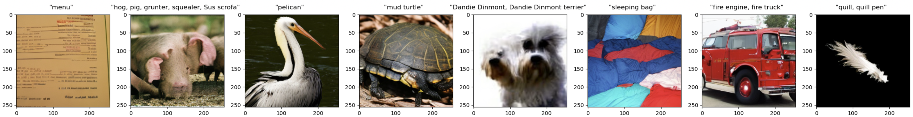
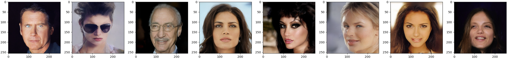

# jax-diffusion-transformer
Implementation of [Diffusion Transformer (DiT)](https://arxiv.org/abs/2212.09748) in JAX. Ported from the official [Pytorch implementation](https://github.com/facebookresearch/DiT).

## Installation
First, clone the repo. Then you can install the conda environment using `conda env create -f environment.yml`. You will need to compile the TFDS datasets for `imagenet2012` or `celebahq`, see [this repo](https://github.com/kvfrans/tfds_builders).

## Details

This implementation implements the standard sizings used in the paper `(DiT-{S,B,L,XL})`. The patch size can also be adjusted independently. The patch size defines a downscaling factor for the input image, which is then flattened. For example, using a patch size of 8, a 256x256 image would become a latent of size 32x32, which is then treated as a vector of length `32x32 = 1024` in the transformer backbone. Images can be processed by a pretrained VAE to reduce the input dimension. The standard choice is to use the Stable Diffusion VAE, which downsamples by 8x.

This code was tested on TPU-v3 machines. It loads a copy of the full model onto each device, loads different data onto each device, then averages the gradients. 

## Usage
To run training code, use `train_diffusion.py`. Evalute FID on a trained model with `eval_fid.py`.

Here are some useful to commands to replicate results. These use the `DiT-B` settings, with patch size of `2` for latent diffusion and `8` for pixels.
```
# Diffusion on Imagenet256 (w/ Stable Diffusion VAE)
python train_diffusion.py --dataset_name imagenet256 --wandb.name DiT-B --model.depth 12 --model.hidden_size 768 --model.patch_size 2 --model.num_heads 16 --model.mlp_ratio 4 --batch_size 512

# Diffusion on CelebaHQ256 (w/ Stable Diffusion VAE)
python train_diffusion.py --dataset_name celebahq256 --wandb.name DiT-B-CelebA --model.depth 12 --model.hidden_size 768 --model.patch_size 2 --model.num_heads 16 --model.mlp_ratio 4 --batch_size 512

# Diffusion on CelebaHQ256 (Pixels)
python train_diffusion.py --dataset_name celebahq256 --wandb.name DiT-B-CelebAPixel --model.depth 12 --model.hidden_size 768 --model.patch_size 8 --model.num_heads 16 --model.mlp_ratio 4 --batch_size 512 --use_stable_vae 0
```

| Model              | FID 50K (ours) | FID 50K (reference paper) |
| :---------------- | :------: | ----: |
| DiT-B Imagenet256, no CFG         |   52.5  | 43.47  ([DiT](https://arxiv.org/pdf/2212.09748))|
| DiT-XL Imagenet256, no CFG     |   N/A  | 9.62  ([DiT](https://arxiv.org/pdf/2212.09748))|
| DiT-B Imagenet256, CFG=4     |  16.34   | N/A|
| DiT-B CelebAHQ256    |  28.35  | 5.11 ([LDM](https://arxiv.org/pdf/2112.10752)) |
| DiT-B CelebAHQ256 (Pixels)  |  47.29  | N/A |

## Examples

DiT-B Imagenet, CFG=4


DiT-B CelebAHQ256


## Acknowledgements

We thank Google TPU Research Cloud (TRC) for granting us access to TPUs for research.
